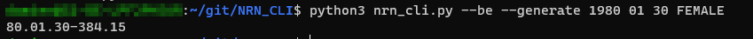

  National Registry Number
   
  <a href="#about"><strong>Explore the screenshots »</strong></a>
   
   
  <a href="https://github.com/DamienDaco/NRN_CLI/issues/new?assignees=&labels=bug&template=01_BUG_REPORT.md&title=bug%3A+">Report a Bug</a>
  ·
  <a href="https://github.com/DamienDaco/NRN_CLI/issues/new?assignees=&labels=enhancement&template=02_FEATURE_REQUEST.md&title=feat%3A+">Request a Feature</a>
  .
  <a href="https://github.com/DamienDaco/NRN_CLI/issues/new?assignees=&labels=question&template=04_SUPPORT_QUESTION.md&title=support%3A+">Ask a Question</a>

---

## About

> **[?]**
> National Number Generator is a command line tool to help generate valid national numbers.
> Currently, this tool works for Belgian numbers only.
> The goal is to simplify the creation of test accounts for development purposes.

> Important: The national numbers are only valid from a purely mathematical standpoint and will pass a simple computation check.
> They are NOT valid from the national registry database standpoint, and will fail all legal checks obviously.

> Other countries may be added at a later date.

Screenshots

 

> **[?]**
> Please provide your screenshots here.

|                               Home Page                               |                               Login Page                               |
| :-------------------------------------------------------------------: | :--------------------------------------------------------------------: |
|  |  |

### Built With

> **[?]**
> Python 3

## Getting Started

### Prerequisites

> **[?]**
> docopt

### Installation

> **[?]**
> git clone this project
> pip3 install docopt

## Usage

> **[?]**
> Let's say you want to generate a national number for a female person born the 30th of January 1980:

> python3 nrn_cli.py --be --generate 1980 01 30 FEMALE

> Display help: 

> python3 nrn_cli.py -h

## License

This project is licensed under the **GNU General Public License v3**.

See [LICENSE](LICENSE) for more information.

